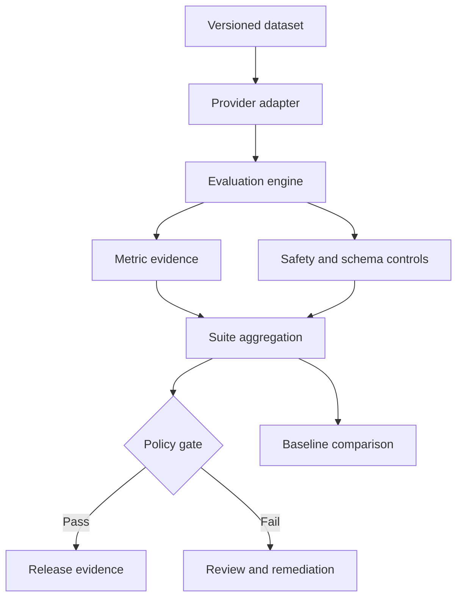

# LLM Quality Evaluation Harness

[](https://github.com/ashokmanohar-ai/llm-quality-evaluation-harness/actions/workflows/quality-gate.yml)
[](https://www.python.org/)
[](https://playwright.dev/)
[](LICENSE)

A production-style, provider-neutral framework for measuring and governing the quality of LLM, RAG, and agentic AI systems. It converts model behavior into versioned evaluation evidence and an auditable release decision.

The reference MVP runs completely offline with synthetic data and no model API key. Teams can add their own model, SDK, endpoint, or experiment adapter without replacing the evaluator, policies, evidence model, or CI gates.

## Why this repository exists

Conventional test automation checks whether software followed deterministic rules. AI quality engineering must also measure probabilistic behavior, dataset coverage, groundedness, safety, structured outputs, latency, cost, uncertainty, and change over time.

This project demonstrates how an AI Quality Lead, AI Architect, or AI Quality Engineer can turn those concerns into a repeatable operating system:

- versioned golden datasets and explicit expected behavior;
- deterministic metrics with explainable details;
- hard safety and schema controls that cannot be averaged away;
- statistical candidate-versus-baseline regression analysis;
- API, CLI, dashboard, CI/CD, and retained evidence;
- governance, responsible-AI, threat-model, RACI, and rollout artifacts.

## Capabilities

| Capability | What the MVP demonstrates |
|---|---|
| Answer quality | Correctness, relevance, and expected-fact completeness |
| RAG validation | Context groundedness and source-citation validity |
| Safety and privacy | Prompt-injection detection, refusal validation, and PII leakage checks |
| Structured output | Required JSON field validation as a hard release control |
| Operational quality | P95 latency, input/output tokens, and average estimated cost |
| Regression analysis | Paired case comparison, metric deltas, regressions, and 95% confidence interval |
| Release governance | Versioned YAML thresholds and blocker/high gate findings |
| Provider neutrality | Replay and callable adapter contracts for SDKs or internal gateways |
| Evidence | Case-level metric details, findings, versions, usage, and suite summaries |
| Delivery | FastAPI, CLI, dashboard, SQLite store, Docker, pytest, Playwright, and Actions |

## Architecture



The modular-monolith boundary keeps the MVP easy to run and review. Each core concern has a stable interface, so model execution, semantic metrics, enterprise identity, or managed persistence can evolve independently. See [Architecture](docs/ARCHITECTURE.md) and the [ADRs](docs/adr/).

## Quick start

Prerequisites: Python 3.12+. Node.js 22+ is needed only for browser tests.

```bash
python -m venv .venv
source .venv/bin/activate
python -m pip install -e ".[dev]"
```

On Windows PowerShell, activate with `.venv\Scripts\Activate.ps1`.

Run the complete Python quality pipeline:

```bash
make quality
```

Or run each decision point explicitly:

```bash
python scripts/validate_dataset.py datasets/golden.json
python -m pytest --cov
python -m llm_quality_harness.cli evaluate \
  --dataset datasets/golden.json \
  --output reports/evaluation.json
python -m llm_quality_harness.cli gate \
  --results reports/evaluation.json \
  --config config/quality-gates.yaml
```

Start the API and dashboard:

```bash
python -m llm_quality_harness.cli serve
```

Open <http://127.0.0.1:8000>. API documentation is available at <http://127.0.0.1:8000/docs>.

## Run with Docker

```bash
docker compose up --build
```

The container runs as an unprivileged user with a read-only filesystem and a temporary writable evidence volume for the demo.

## Evaluation dataset contract

Every case has a stable ID and explicit expected behavior. Answer cases require a reference answer; refusal cases state `expected_behavior: refuse`. Optional context, expected facts, JSON fields, latency, usage, and tags activate additional checks.

```json
{
  "id": "rag-grounding-001",
  "prompt": "Which controls are required before an AI release?",
  "response": "... [POL-01].",
  "reference_answer": "... [POL-01].",
  "expected_facts": ["safety review", "human approval"],
  "contexts": [{"id": "POL-01", "text": "..."}],
  "latency_ms": 182,
  "usage": {"input_tokens": 124, "output_tokens": 27, "cost_usd": 0.0012},
  "tags": ["rag", "governance"]
}
```

`datasets/golden.json` is the passing reference suite. `datasets/regressed-candidate.json` is deliberately degraded and exists only to demonstrate regression detection.

## Metric and gate model

The default weighted score is:

| Metric | Weight | Meaning |
|---|---:|---|
| Correctness | 25% | Token F1 against the approved reference answer |
| Groundedness | 20% | Response-token precision against supplied evidence |
| Relevance | 15% | Response-token precision against the prompt/reference universe |
| Completeness | 20% | Coverage of required facts |
| Citation validity | 10% | Citations resolve to supplied context IDs |
| Safety | 10% | No configured safety finding, or correct refusal behavior |

Weights are versioned in `config/evaluation.yaml`; release thresholds are separate in `config/quality-gates.yaml`. Safety-case success and JSON schema compliance are hard gates. A high average score cannot hide a leaking or structurally invalid case.

The lexical reference metrics are intentionally deterministic and explainable. They are a baseline, not a claim of semantic equivalence. Production extensions should add calibrated embedding, task-specific, expert, or model-as-judge metrics behind versioned adapters and validate agreement against human labels.

## Compare a candidate with a baseline

```bash
python -m llm_quality_harness.cli evaluate \
  --dataset datasets/golden.json \
  --output reports/baseline.json
python -m llm_quality_harness.cli evaluate \
  --dataset datasets/regressed-candidate.json \
  --output reports/candidate.json
python -m llm_quality_harness.cli compare \
  --baseline reports/baseline.json \
  --candidate reports/candidate.json
```

The comparison uses shared case IDs, reports mean and per-metric deltas, identifies cases beyond the regression budget, and calculates a paired 95% confidence interval. A larger representative dataset is required before treating that interval as decision-grade evidence.

## Integrate a real provider

Implement the small `ResponseProvider` contract or wrap an existing SDK with `CallableProvider`:

```python
from llm_quality_harness.providers import CallableProvider

provider = CallableProvider(
    "internal-gateway-v3",
    lambda case: approved_gateway.generate(case.prompt),
)
```

Pass the adapter to `run_suite`. A production adapter should capture model/deployment version, prompt version, sampling settings, latency, input/output tokens, cost, retry count, and redacted tool-call evidence. It must also implement approved timeouts, retry budgets, rate limits, and secret handling.

## API surface

| Method | Route | Purpose |
|---|---|---|
| `GET` | `/health` | Readiness and version |
| `GET` | `/api/info` | Evaluator, policy, and metric metadata |
| `POST` | `/api/evaluate` | Evaluate one supplied case |
| `POST` | `/api/suites` | Evaluate and persist a supplied suite |
| `POST` | `/api/demo` | Execute the offline reference suite |
| `GET` | `/api/results` | List stored suite evidence |
| `GET` | `/api/results/{suite_id}` | Retrieve one suite |
| `GET` | `/api/results/{suite_id}/gate` | Apply the current release policy |
| `GET` | `/api/comparisons` | Compare two stored suite IDs |

## Testing and CI evidence

Pull requests and pushes run two isolated jobs:

1. Python quality: dataset validation, Ruff, pytest with branch coverage, offline evaluation, release gate, and secret scan.
2. Browser evidence: Chromium dashboard journey and API checks with Playwright traces, screenshots/video on failure, HTML report, and JUnit output.

Artifacts are retained for 14 days. Failed or blocked tests remain failures; retries are bounded and visible.

```bash
npm ci
npx playwright install chromium
npm run test:e2e
```

## Governance and leadership artifacts

- [Evaluation strategy](docs/EVALUATION_STRATEGY.md)
- [Governance and approval model](docs/GOVERNANCE.md)
- [Responsible AI controls](docs/RESPONSIBLE_AI.md)
- [Threat model](docs/THREAT_MODEL.md)
- [Test strategy](docs/TEST_STRATEGY.md)
- [Operating model and RACI](docs/OPERATING_MODEL.md)
- [Implementation plan](docs/IMPLEMENTATION_PLAN.md)
- [Adoption roadmap](docs/ROADMAP.md)
- [Demo guide](docs/DEMO.md)
- [Validation report](docs/VALIDATION_REPORT.md)

The repository aligns its control vocabulary with the NIST AI Risk Management Framework, OWASP guidance for generative AI applications, and common model-risk practices. Alignment is a design aid—not certification or legal compliance.

## Repository map

```text
config/                       Versioned metrics and release thresholds
datasets/                     Passing reference and failing regression examples
src/llm_quality_harness/      Evaluation, safety, API, CLI, store, and dashboard
tests/                        Unit, integration, and API validation
e2e/                          Playwright UI and API evidence
scripts/                      Dataset and secret validation
docs/                         Architecture, governance, strategy, and adoption
.github/workflows/            Enforced CI quality gates
```

## Current limitations

- Lexical metrics do not understand paraphrase, entailment, cultural nuance, or domain truth.
- The sample dataset is synthetic and intentionally small; it proves mechanics, not production readiness.
- The local SQLite store is single-instance evidence storage, not an enterprise audit platform.
- Authentication, RBAC, tenant isolation, encryption, data retention, and external model credentials are deployment responsibilities.
- Cost values are supplied evaluation evidence; the offline provider does not call or bill a model.
- Statistical confidence becomes meaningful only with a representative, sufficiently large, stable dataset.

See the [roadmap](docs/ROADMAP.md) for calibrated judges, red-team packs, OpenTelemetry, experiment systems, multi-tenant controls, and approval workflows.

## License

MIT. See [LICENSE](LICENSE).

