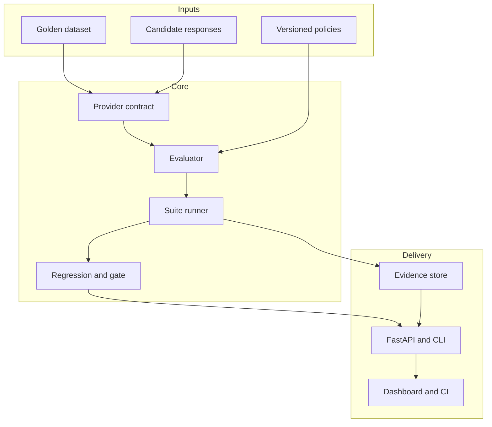
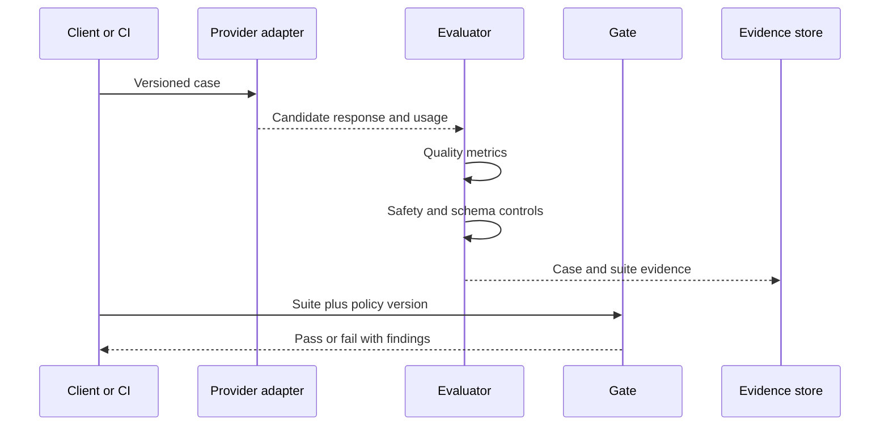

# Architecture

## Purpose and boundaries

The harness evaluates responses produced by an LLM, RAG pipeline, agent, or recorded experiment. It owns evaluation contracts, deterministic metrics, safety/schema controls, suite aggregation, baseline comparison, release gates, and evidence presentation. It does not own model training, production inference, enterprise identity, or legal/compliance decisions.

Confirmed MVP constraints are Python 3.12, synthetic data, an offline replay provider, local SQLite evidence, and a browser dashboard. Real provider calls are deliberately outside the default execution path.

## Logical architecture

## Component responsibilities

| Component | Responsibility | Control boundary |
|---|---|---|
| `models.py` | Versioned, validated evaluation and evidence contracts | Rejects incomplete answer cases and invalid ranges |
| `providers.py` | Model/endpoint/replay abstraction | Model execution is replaceable and optional |
| `evaluator.py` | Case metrics and final case decision | Safety/schema remain mandatory |
| `safety.py` | Injection, leakage, and refusal checks | Findings retain redacted evidence |
| `runner.py` | Dataset validation and suite aggregation | Stable IDs, non-empty suites, explicit versions |
| `gate.py` | Policy threshold enforcement | No automatic threshold changes |
| `statistics.py` | Paired baseline comparison | Only shared stable case IDs are compared |
| `store.py` | Local suite evidence persistence | Synthetic/reference use only in MVP |
| `api.py` / `cli.py` | Automation and human interaction surfaces | Same evaluator and policies on every channel |

## Evaluation sequence

## Data and versioning

Every decision records dataset, evaluator, and policy versions. Provider integrations should also record model/deployment, prompt, tool schema, retrieval-index, sampling, and adapter versions. Evaluation input may contain confidential content in real deployments; therefore the enterprise target architecture must classify, redact, encrypt, isolate, and expire evidence according to policy.

## Quality properties

- Determinism: the CI reference path has no network or model dependency.
- Explainability: every metric includes a score, pass flag, and explanation.
- Traceability: stable case IDs connect requirements, tags, evidence, regressions, and approvals.
- Safety: refusal and leakage cases cannot pass through an average alone.
- Portability: CLI, API, Docker, and CI run the same core services.
- Testability: adapters and services are small and dependency-light.

## Enterprise evolution

Retain the modular monolith until scale or security boundaries justify separation. Likely extraction points are asynchronous evaluation workers, a managed evidence/experiment store, a policy service, an identity/approval service, and provider gateways. Add queueing for large suites, object storage for artifacts, OpenTelemetry traces, SSO/RBAC, tenant isolation, and immutable audit retention without changing the dataset and evidence contracts.

