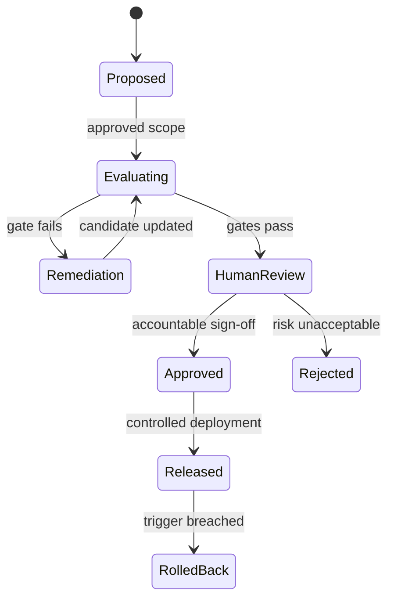

# Governance and approval model

## Principles

Govern before generating, test the approved purpose, keep evidence reproducible, apply least privilege, separate builder and approver duties, and require accountable human decisions at consequential boundaries.

## Change classes

| Change | Minimum review | Required evidence |
|---|---|---|
| Code/refactor with no behavior change | Engineering + quality | Unit/integration/E2E results |
| Prompt, retrieval, model, tool, or sampling change | Product + quality | Baseline comparison and slice results |
| Dataset/reference/threshold change | Domain owner + quality + risk owner | Rationale, provenance, calibration, impact analysis |
| New provider or external data transfer | Architecture + security/privacy | Threat/privacy assessment and operational controls |
| New consequential tool action | Business owner + security/risk + quality | Sandbox evidence, allowlist, approval/rollback design |
| Production release | Accountable release owner | Passed gates, signed exceptions, monitoring and rollback readiness |

## Controlled release flow

Automated gates may stop a release but may not independently authorize a high-impact deployment.

## Mandatory controls

- immutable version identifiers for model, prompt, retrieval, tools, data, evaluator, and policy;
- SSO/RBAC, least privilege, tenant/project isolation, approved secret storage, and redaction;
- environment and tool-action allowlists with bounded time, retry, concurrency, token, and cost budgets;
- synthetic test data by default and formal approval for sensitive data;
- injection-resistant RAG boundaries and source provenance;
- retained requests/responses only when policy permits, with encryption and deletion controls;
- separation of authorship, evaluation, threshold approval, and release approval for high-risk use cases;
- time-bound exceptions with owner, compensating control, and expiry.

## Audit record

Each governed run should capture correlation/run ID, actor and role, purpose/use case, environment, all relevant versions, timestamps, redacted inputs/outputs, metrics, tool calls, tokens/cost, findings, retries, gate result, reviewer decisions, exceptions, and deployment/rollback link.

## Control references

The operating vocabulary is informed by NIST AI RMF functions (Govern, Map, Measure, Manage), OWASP generative-AI risk themes, secure SDLC, and model-risk management. Teams must map these design controls to their own laws, contracts, policies, and assurance requirements. This repository does not provide certification or legal compliance.

